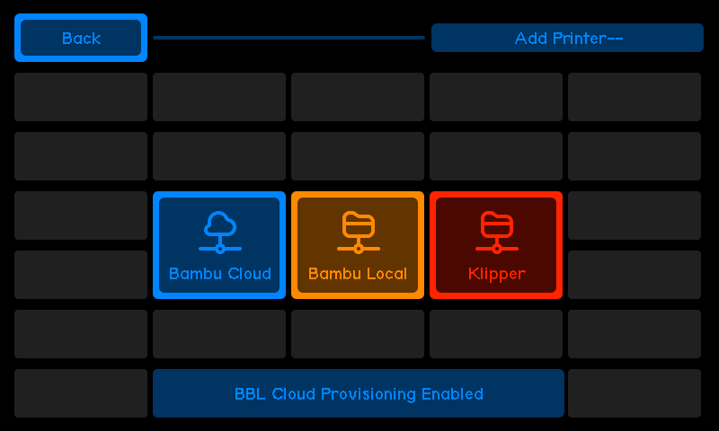

# Add Printer Screen

### The **Add Printer Screen** allows you to add printers to the system.

2. **BBLLocal**

   - The user will need to provide the following details for their BBL Local Printer:
     - **IP Address**
     - **Serial Number**
     - **Access Code**
   - After entering the data, if the process fails, the user will be returned to the start of the process to try again.

3. **Klipper**

   - The user will need to provide:
     - **IP Address**
     - **Port**
     - **Printer Name**
   - After entering the data, if the process fails, the user will be returned to the start of the process to try again.

:::warning[Additional Klipper Setup]

By default, the system will work with Klipper printers for **basic controls**, such as starting and stopping print jobs, temperature monitoring, and head movement.

For the **full experience**, additional steps are required to configure Klipper with advanced features.
:::
:::tip[Detailed Klipper instructions]
**For detailed instructions on enabling full functionality with Klipper printers**, refer to the [Klipper Extra Setup Page](#).
:::
