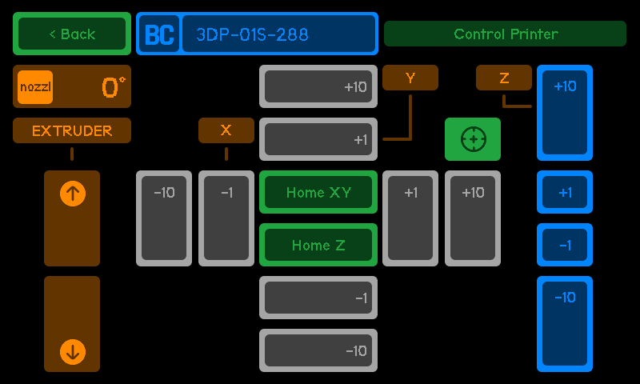

# Control Screen

The **Control Printer Screen** allows the user to move and manage the printer's axes, extruder, and perform homing operations. This screen provides precise control over the printer's motion.

1. **Temperature and Extruder Control**:

   - **Nozzle Temperature**: Displays the current nozzle temperature (e.g., **0°C**).
   - **Extruder Buttons**:
     - **Extrude Button**: Manually **extrudes filament**.
     - **Retract Button**: Manually **retracts filament**.

2. **X, Y, Axis Movement**:

   - **Movement Steps**:
     - **+10**, **+1**, **-1**, and **-10**: Move the selected axis by the specified increments.
   - **Homing Buttons**:
     - **Home XY**: Homes the **X** and **Y** axes.
     - **Home All**: Homes all axes.

3. **Z Axis Movement**::
   - **Movement Steps**
     - **+10**, **+1**, **-1**, and **-10** Move the Z axis by the specified increments.

:::warning[Movement Behavior]
If a movement is attempted and the printer has **not been homed**, the system will **blink the "Home All" button** to indicate that homing is required before proceeding.  
For printers that **do not require homing**, the system will allow movements to proceed without any additional actions. The behavior will adjust accordingly based on the printer's requirements.
:::
