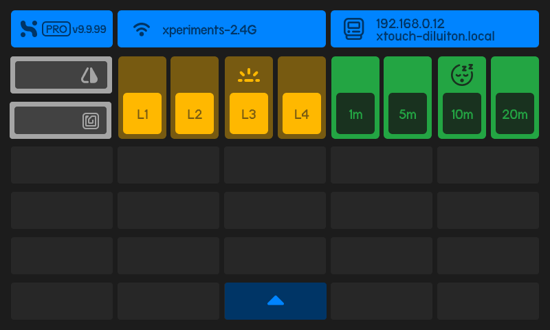

# Settings Screen

The **Settings Screen** provides access to screen settings and system indicators.

:::tip[Accessing]
To access this screen, **swipe down** on the display.
:::

## Top Bar

The top bar displays system information and status indicators for the XTouch device.

- **XTouch Version**:
  - `PRO v9.9.99` – Displays the current firmware version of the XTouch device.
- **Network Connection**:
  - `xperiments-2.4G` – The SSID of the Wi-Fi network the XTouch is currently connected to.
- **Device IP & Hostname**:
  - `192.168.0.12` / `xtouch-diluiton.local` – Indicates the IP address and hostname for local network access.

## Action Buttons

- **Flip Screen Button**:

  - Flips the orientation of the screen display.
  - Useful for mounted or inverted screen installations.

- **RFID Button**:
  - Activates RFID functionality for devices requiring identification or tagging.

## Screen Brightness Control

The **L1 to L4** buttons allow users to adjust screen brightness to suit different environments:

| **Button** | **Function**                 |
| ---------- | ---------------------------- |
| **L1**     | Low brightness               |
| **L2**     | Medium brightness            |
| **L3**     | High brightness _(Sun Icon)_ |
| **L4**     | Maximum brightness           |

:::tip[Power usage]
Use these buttons to optimize power usage or improve visibility in varying lighting conditions.
:::

---

## Screen Sleep Timer

The **1m to 20m** buttons set the duration for the screen sleep timer (auto-standby):

| **Button** | **Sleep Duration**                                |
| ---------- | ------------------------------------------------- |
| **1m**     | Screen sleeps after **1 minute** of inactivity.   |
| **5m**     | Screen sleeps after **5 minutes** of inactivity.  |
| **10m**    | Screen sleeps after **10 minutes** _(Sleep Icon)_ |
| **20m**    | Screen sleeps after **20 minutes** of inactivity. |

:::tip[Power usage]
**Sleep Mode**: Reduces energy consumption when the screen is idle.
:::
