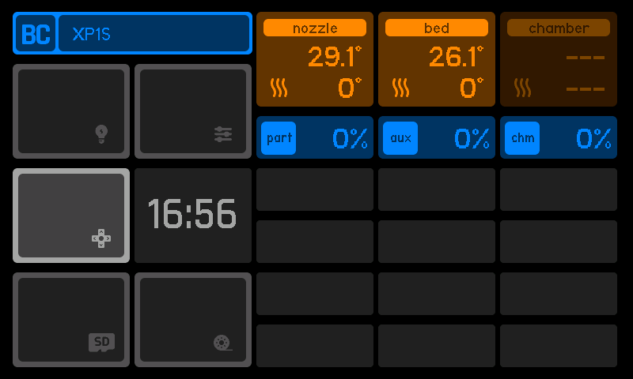
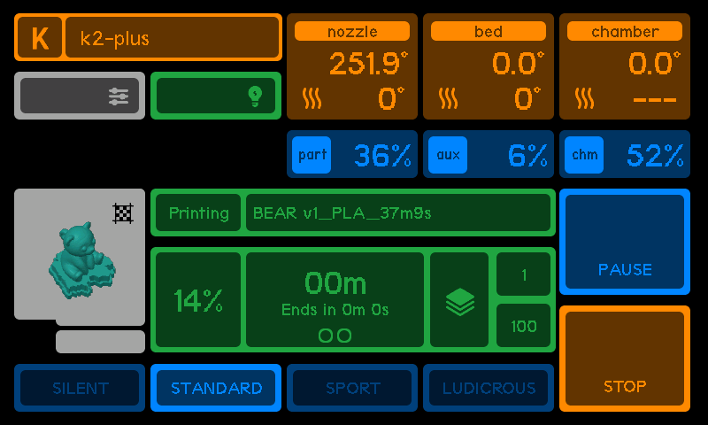

# Main Screen

The **Main Screen** lets you manage your **pinned printer**.

:::tip[Glossary]
A **Pinned Printer** is the currently selected printer displayed on the main interface.
:::

## IDLE

### When the printer is **idle** (not doing an active job):

1.  **Printer Information**:

    - **Printer Name**: Displayed in the top-left corner (e.g., "XP1S").
      :::tip[Navigation]
      Clicking the printer name allows you to **Manage other printers** in the system and switch between them.
      :::

2.  **Temperature Readings**:

    - **Nozzle Temperature**: Displays the current nozzle temperature (e.g., 29.1°C).
    - **Bed Temperature**: Displays the current bed temperature (e.g., 26.1°C).
    - **Chamber Temperature**: Appears inactive, showing `--`.
      :::tip[Navigation]
      Clicking on any temperature value allows the user to **manually enter a new target temperature** for the corresponding component (nozzle, bed, or chamber).
      :::

3.  **Fan Speeds**:

    - **Part Fan**, **Auxiliary Fan (aux)**, and **Chamber Fan (chm)**: Displayed with percentages, all currently at `0%`.
      :::tip[Navigation]
      Clicking on any fan percentage allows the user to **set a new fan speed** for the selected fan.
      :::

4.  **Time**:

    - Displays the current system time (e.g., 16:56).

5.  **Interactive Buttons**:  
    These buttons provide quick access to printer features:

    - **Light Button**: Toggles the printer light **on/off**.
    - **Control Button**: Opens the **head movement control** interface.
    - **Filament Control Button**: Allows managing filament actions, such as **loading** or **unloading filament**.
    - **Printer Settings Button**: Reserved for printer settings (**currently disabled - TBD**).
    - **File Browser Button**: Accesses the file browser (**currently disabled - TBD**).

## PRINTING

### Main screen displays detailed real-time information about the current print job

1.  **Printer Information**:

    - **Printer Name**: Displayed in the top-left corner (e.g., "XP1S").
      :::tip[Navigation]
      Clicking the printer name allows you to **Manage other printers** in the system and switch between them.
      :::

2.  **Temperature Readings**:

    - **Nozzle Temperature**: Displays the current nozzle temperature (e.g., 29.1°C).
    - **Bed Temperature**: Displays the current bed temperature (e.g., 26.1°C).
    - **Chamber Temperature**: Appears inactive, showing `--`.
      :::tip[Navigation]
      Clicking on any temperature value allows the user to **manually enter a new target temperature** for the corresponding component (nozzle, bed, or chamber).
      :::

3.  **Fan Speeds**:

    - **Part Fan**, **Auxiliary Fan (aux)**, and **Chamber Fan (chm)**: Displayed with percentages, all currently at `0%`.
      :::tip[Navigation]
      Clicking on any fan percentage allows the user to **set a new fan speed** for the selected fan.
      :::

4.  **Print Progress**:

    - **Progress Bar**: Shows the print job's completion percentage (e.g., **20%**).
    - **Time Remaining**: Displays the estimated time remaining (e.g., **00m**) and "Ends in **0m 0s**".
    - **Layer Information**: Current layer and total layers (e.g., **1/100**).

5.  **Print Controls**:

    - **Pause Button**: Allows pausing the print job.
    - **Stop Button**: Stops the print job immediately.
      :::tip[Navigation]
      These buttons require a **long press** to be processed
      :::

6.  **Speed Settings**:  
    Options to set the print speed modes:

    - **Silent**, **Standard**, **Sport**, and **Ludicrous**.
      :::tip[Navigation]
      These buttons require a **long press** to be processed
      :::

7.  **Print Preview**:  
    Displays an **image preview** of the current print job, showing the printed model.
